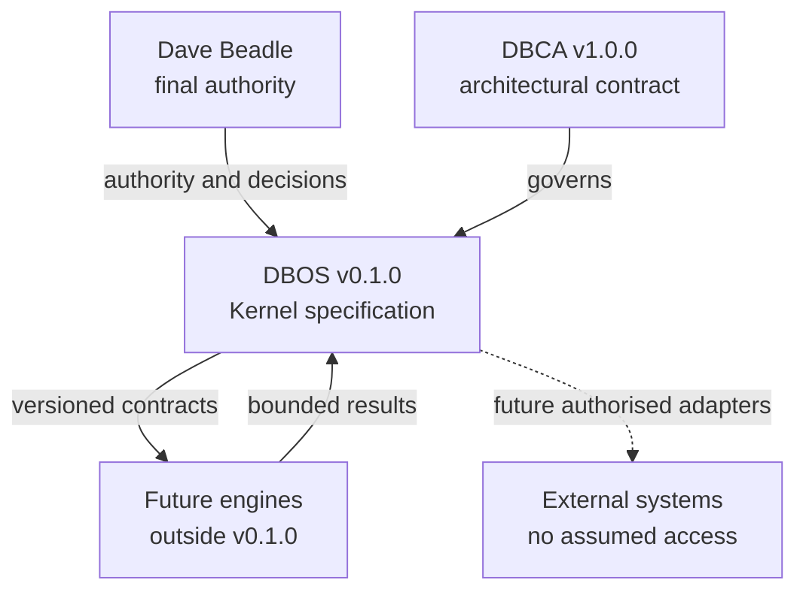

# System Context

| Field | Value |
|---|---|
| Document ID | DBOS-DIA-001 |
| Version | 0.1.0 |
| Related | DBOS-GOV-002; DBOS-ARC-001 |

DBCA never depends on DBOS. External access exists only when a future adapter, permission and evidence boundary explicitly establish it.

