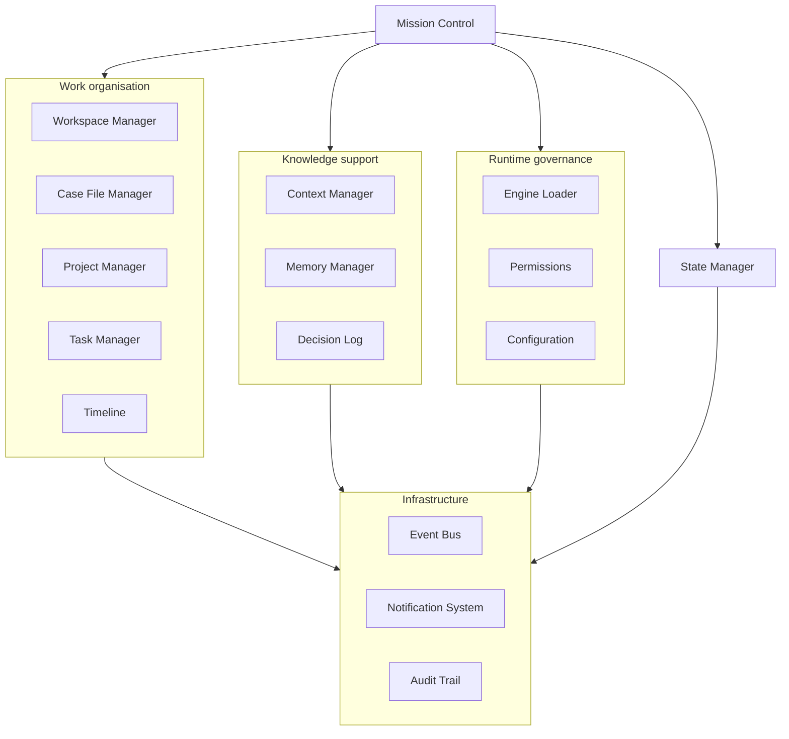

# Kernel Component Architecture

| Field | Value |
|---|---|
| Document ID | DBOS-DIA-002 |
| Version | 0.1.0 |
| Related | DBOS-ARC-001; DBOS-ADR-001 |

Arrows show contract use, not state ownership. Infrastructure services never acquire domain decision authority.

