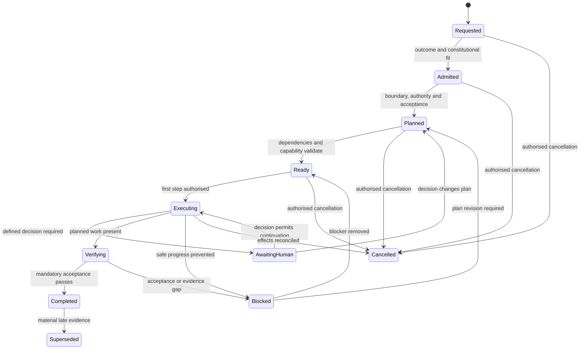

# Mission Lifecycle Coordination

| Field | Value |
|---|---|
| Document ID | DBOS-DIA-003 |
| Version | 0.1.0 |
| Related | DBOS-ARC-002; DBOS-KRN-001; DBOS-KRN-010 |

Mission Control owns mission meaning; State Manager evaluates and records every transition guard.

