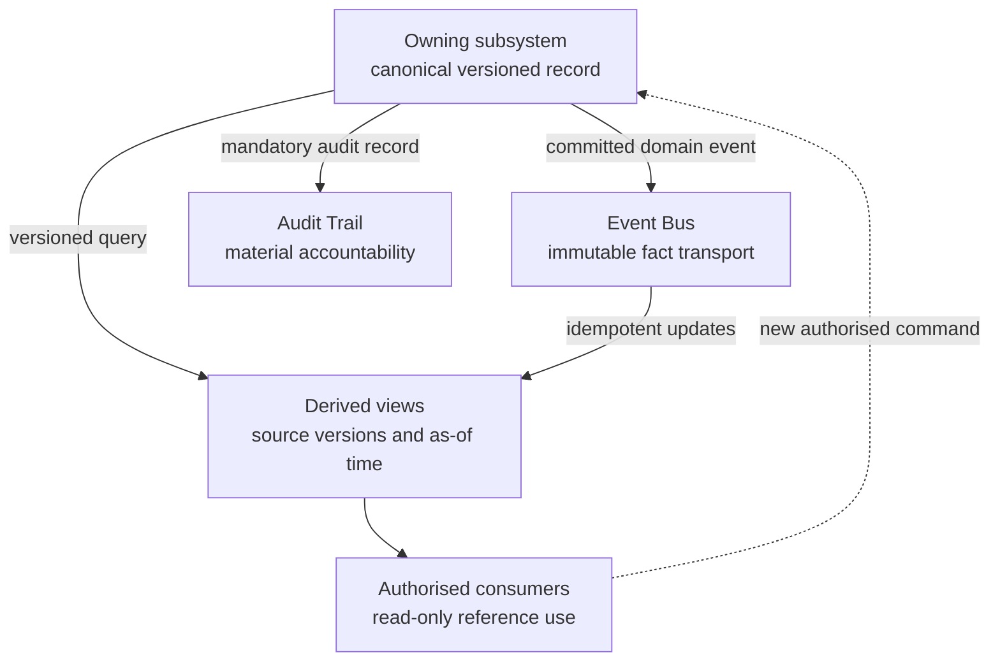

# Source-of-Truth Ownership and Projections

| Field | Value |
|---|---|
| Document ID | DBOS-DIA-004 |
| Version | 0.1.0 |
| Related | DBOS-ADR-001; DBOS-CTR-001 |

A projection cannot write back inferred truth. Any change returns as a new authorised command to the owner.

