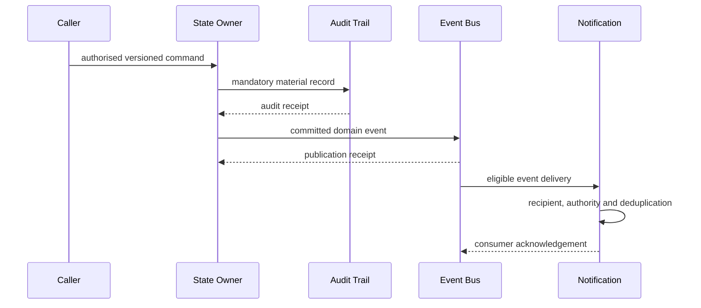

# Mutation, Event, Notification and Audit Flow

| Field | Value |
|---|---|
| Document ID | DBOS-DIA-005 |
| Version | 0.1.0 |
| Related | DBOS-ADR-002; DBOS-ADR-007; DBOS-ADR-008 |

Audit acceptance and domain event commitment are both required according to action policy, but notification delivery never determines the owner's state.

