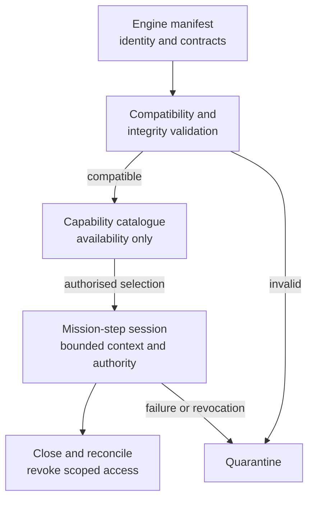

# Engine Registration and Bounded Loading

| Field | Value |
|---|---|
| Document ID | DBOS-DIA-006 |
| Version | 0.1.0 |
| Related | DBOS-ADR-005; DBOS-CTR-008 |

Trust and delegation are evaluated outside availability. DBOS v0.1.0 contains no registered domain engine.

