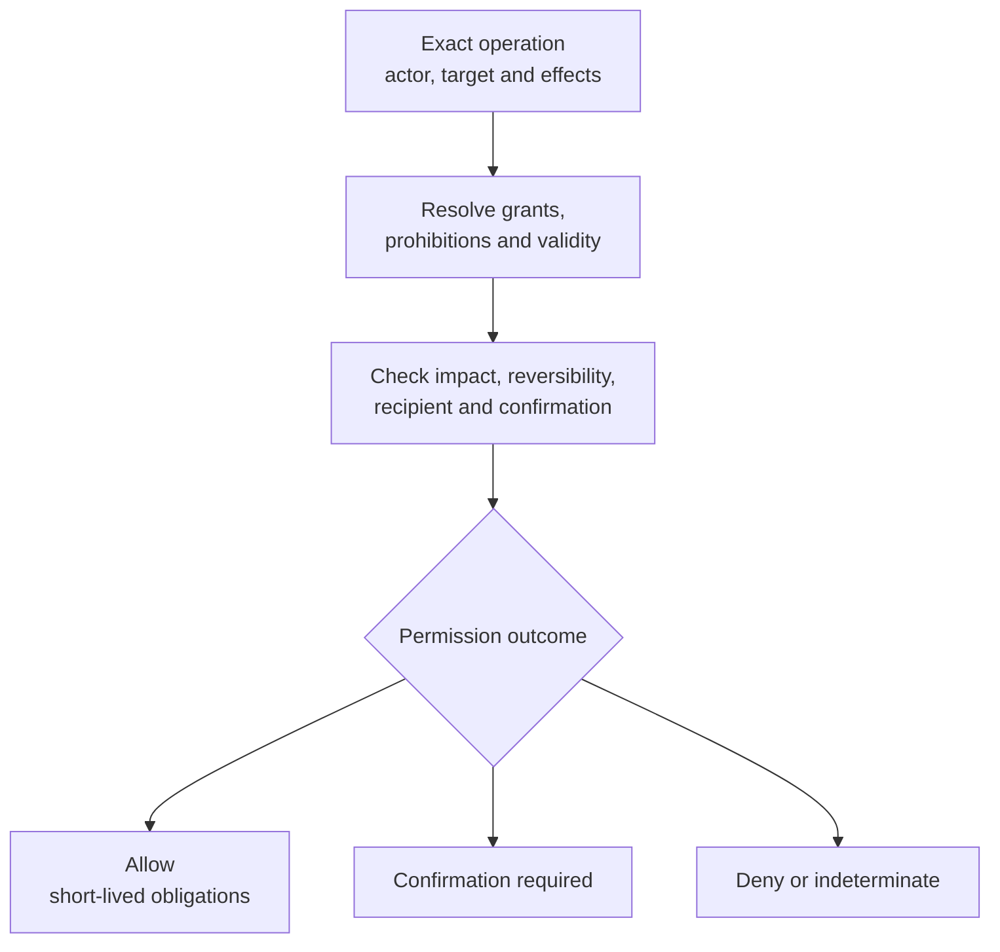

# Permission Evaluation

| Field | Value |
|---|---|
| Document ID | DBOS-DIA-007 |
| Version | 0.1.0 |
| Related | DBOS-ADR-004; DBOS-CTR-004 |

The state owner rechecks the decision immediately before mutation. Access, trust and urgency do not enter as substitute grants.

