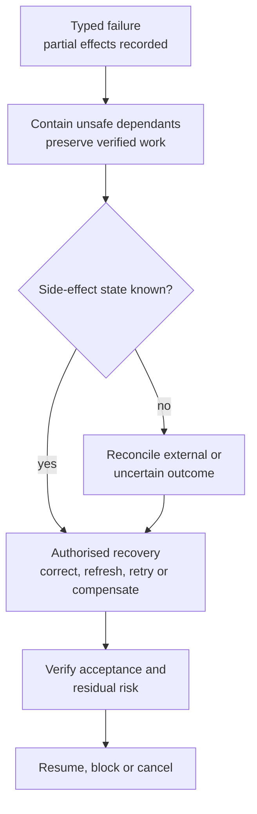

# Failure Containment and Recovery

| Field | Value |
|---|---|
| Document ID | DBOS-DIA-008 |
| Version | 0.1.0 |
| Related | DBOS-CTR-006; DBOS-ARC-002 |

Blind retry is prohibited for non-idempotent or unknown side effects. Recovery failure creates a linked failure record.

